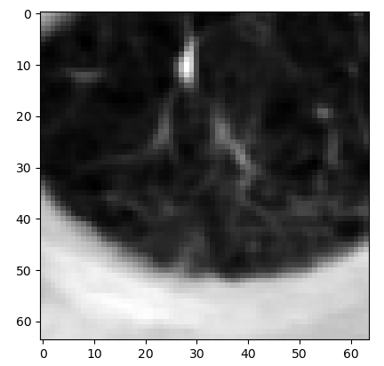
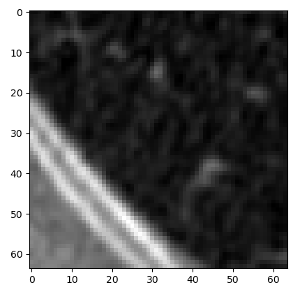

# README


# Task Introduction

The aim of this work is to use a deep neural network approach to the diagnosis of malignancy in lung nodules.

## Dataset

The dataset for this work were obtained from [https://www.kaggle.com/datasets/kmader/lungnodemalignancy](https://www.kaggle.com/datasets/kmader/lungnodemalignancy) , which is a processed edition of [https://luna16.grand-challenge.org/](https://luna16.grand-challenge.org/) . So our dataset should be used with the same policy that LUNA16 has.

LUNA16 is a dataset containing a two-stage task. In first stage, you need to identify the location of the suspicious nodule in the whole lung CT image. In second stage, you are asked to diagnose the identified suspicious nodules as benign or malignant.

The main processing of LUNA16 by the dataset we are using lies in locking down the location of the suspicious nodes by cropping, so you only need to complete the second stage task above.

Please download the dataset from [https://www.kaggle.com/datasets/kmader/lungnodemalignancy](https://www.kaggle.com/datasets/kmader/lungnodemalignancy) and move all_patches.hdf5 into /LNMC/dataset/ in our workspace.

## Data Display



Malignant nodule sample



Benign nodule sample

For a more extensive display of sample images, please adjust and re-run utils/show_image.py：

```python
cd /LNMC/utils/
python show_image.py
```


# Experiment Procedure

## Data preprocess

### 1. read the .hdf5 CT_images to numpy ndarray

```python
cd /LNMC/utils/
python read_dataset.py
```

### 2. Do data augment by rescale intensity and normalization

```python
cd /LNMC/utils/
python data_augment.py
```

### 3. Split dataset to training and validation

```python
cd /LNMC/utils/
python split_dataset.py
```

## Training

please config the hyperparameters {epochs, batch_size, num_classes, dropout_prob, weight_decay} and re-run train/train.py

```python
cd /LMNC/train/
python train.py
```

## Inference

To examine the training results, two methods are provided: loss function curves and validation set accuracy and f1 scores.

### 1. Loss function curves

the loss function curves have been saved during training procedure. Please change the .csv file path to your own and do as following to show them:

```python
cd /LNMC/train/
python loss_show.py
```

### 2. Accuracy and F1 score

the parameters of model have been saved as .pth file during training procedure. Please change the .pth file path to your own and do as following to test your model

```python
cd /LNMC/utils/
python F1_score.py
```


# Others may help you:

1. We keep a copy of the trained model weight parameters in /LNMC/checkpoint/ConvNet_11.pth, which achieves 87.68% accuracy on the validation set as well as an f1 score of 0.8927. You can load it directly for use via the torch.load() method.
2. If you have a problem, please submit your question via Issues and I'll be happy to answer it!
